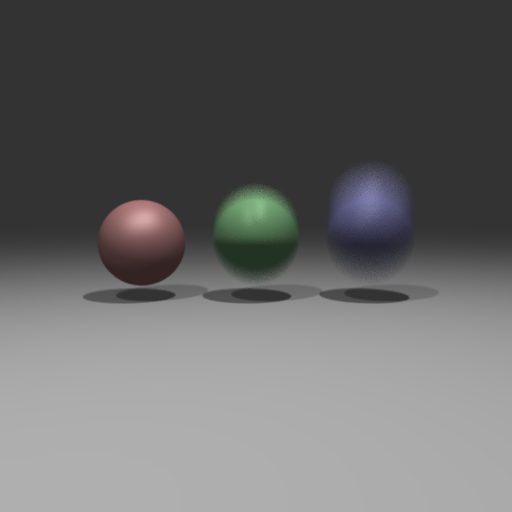
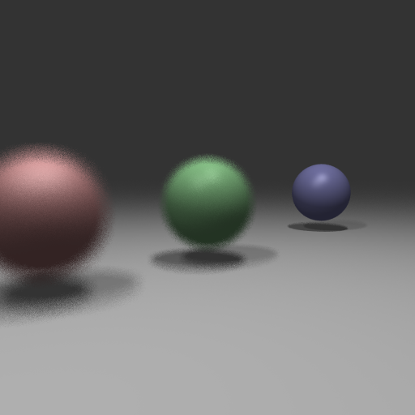
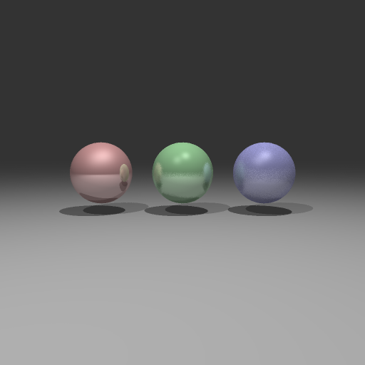
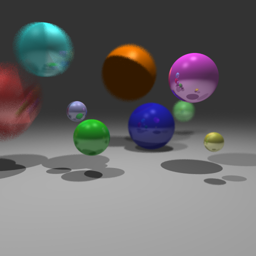

CS77 Final Project
==================

### Grady Redding

For my final project, I decided to build off of my previous raytracer to add additional features. I first began by fixing my raytracer as it had a slight issue with casting the shadow rays when I turned it in for P02. I was having an issue where certain scenes would appear to be darker than they should have been but I was able to get this resolved pretty quickly by adding another restriction to my if statement to check if the light was being blocked by a surface. Once I had this fixed, I began working on the following 3 features.

Feature 1: Motion Blur
----------------------

The first feature I chose to implement was motion blur. I considered two implementation options for this feature. This first implementation choice was to add a velocity component to the objects in order to simulate motion. The second option I considered was adding a velocity component to the camera. I ultimately wanted to be able to show moving objects next to still objects so I thought it would be better to take the first approach and have the objects move. In order to do this, I added a time component to the ray. For each ray, I would generate a random number in the \[0, 1\] range to represent the time at which the ray was shot. Then I would adjust the object's position (in this case spheres) accordingly by adding the velocity \* time component to the sphere's center. This would move the sphere to its position at time t, allowing for the ray to intersect/not intersect the sphere when it was at this updated position. The image above demonstrates three different spheres, each having a different velocity. The first sphere has no velocity, and it is very clear. The second sphere has a slight upward velocity, and it is slightly blurry. Finally the third sphere has a larger upwards velocity and it is much more blurry. I know this implementation is correct because I randomly assign the circle's position to any of the possible locations during the time period based on its velocity, and it is easy to see that the image correctly shows the motion blur effect. The main issue I ran into during implementation was that when calculating my random value, I was generating an integer 1-10, and then dividing by 10 which would create 10 possible circle locations. This made it look like there were only 10 frames of movement, so I found that increasing the range of my random number to 1000 created a much smoother image. I also found that increasing the number of samples greatly increased the appearance of the image. In order to implement this feature, I relied mostly on the notes from Ray Tracing: The Next Week as well as the slideshow linked in the final project document.

Feature 2: Lens/Depth Blur
--------------------------

The next feature I chose to implement was lens/depth blur. I did this by simulating a lens by jittering my camera position by a random number so that it would be within the aperture for a number of samples. Then I would point all of these samples towards the focal point, which was found by scaling the original direction from the camera frame to the pixel by the focal distance. Then all of these rays would be pointed towards the focal point, and their colors would be averaged. This allows for images closer to the focal plane to appear clear, while images further away from the focal plane would experience more distortion as the rays diverged further from their original direction. The images above demonstrate three spheres, each at different distances from the camera. In the first image, the aperture is relatively small so there is less distortion, and the focal distance is set to 7 (right around the distance of the second sphere). The first sphere is closer to the camera than the focal plane so it experiences a moderate amount of blur. The second sphere is centered at the focal plane so it appears very clear. Finally, the third sphere is centered further away than the focal plane so it is more blurry. Next in the second image the aperture is increased slightly, and the focal distance is increased as well to 11. This results in a slightly more blurry image, and the furthest sphere is in better focus while the closest two are not. Some issues I ran into during implementation were simply figuring out the math. I originally considered trying to implement the lens like an actual camera lens and reflecting the ray through it before I settled on the easier approach of randomizing the ray start position within the aperture size. This made it much easier to calculate the focal point and generate the correct rays. I also found that increasing the number of samples greatly increased the appearance of the image to make it look less pixelated. I know my implementation is correct because changing the focal distance changes which objects are in focus, and changing the aperture size affects how large the distortion effect is on the objects. In order to implement this feature, I relied mostly on notes from Ray Tracing: In One Weekend as well as the slideshow linked in the final project document.

Feature 3: Blurry Reflections/Refractions
-----------------------------------------

The third feature I chose to implement was blurry reflections/refractions. I did this by sending the normal reflection ray, and then adding a random unit vector in the x, y, and z direction scaled by the fuzziness coefficient for each sample. Then each of these vectors were averaged in order to find the color accumulation from the reflection. The image above demonstrates three spheres, each of which have the same kr values, however they have different fuzziness coefficients. The first has a fuzziness coefficient of 0.1, the second has a coefficient of 3, and this third has a coefficient of 8. This results in the reflection of each sphere getting progressively more diluted. One issue I ran into was my code kept getting stack overflow errors, which I assume was caused by too many reflection rays being calculated. In order to fix this, I added a depth variable to my irradiance function to keep track of how many times it was being recursed, and I set the limit to 5. This seemed to speed the program up and eliminated the issue. Finally, I know my implementation is correct because it slightly modifies the reflection ray randomly based on the fuzziness coefficient, and it is clear that increasing the amount of random modification results in a blurrier reflection which is the intended effect. In order to implement this feature, I relied mostly on notes from Ray Tracing: In One Weekend as well as the slideshow linked in the final project document.

Creative Artifact
-----------------

In my creative artifact, I seek to demonstrate all of the features that I have implemented. The image contains a number of spheres of different sizes and at different locations, and each has its own unique characteristics. Some are reflective, each having its own fuzziness coefficient, while others have velocity. They are at varying z-levels, and the focal distance is set to 8 with an aperture size of 0.2 which makes some appear more in focus than others. It is easy to see the red and cyan balls on the right moving, while the light purple ball on the right has a lower fuzziness coefficient than the dark green ball in the middle. Additionally, you can see that some balls are pretty focused, while the light green ball on the right is too far away from the focal plane. When building this scene the only issue I ran into was the amount of time it took to render. Because of this, I initially set the number of samples to be very low in order to increase the speed of iteration so I could find places for all the balls so they would be clearly visible. Overall, I found this project to be extremely rewarding and I look forward to adding additional features to my raytracer in the future.